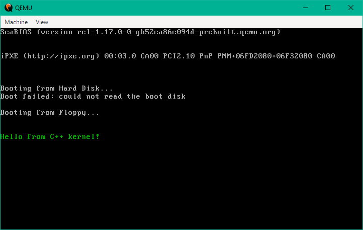

# MoleculeOS

**MoleculeOS** is a minimalist, text-based monolithic operating system, <br>
developed in C++ by GitHub user *Lukenar11 (Luke Matthes)*.

The goal of this project is to create a clearly structured, 
modular learning and experimentation system that makes the fundamental building blocks of an operating system <br>
understandable and transparent - hence the name *MoleculeOS*.

---

## Features (current / planned)

- Custom BIOS boot setup (x86)
- Stage‑1 boot sector + Stage‑2 loader
- Minimal 32‑bit kernel in C++
- VGA text mode output
- Basic hardware initialization
- Interrupt Descriptor Table (IDT)
- More subsystems to follow

---

## Design Philosophy

MoleculeOS is intentionally simple:

- no paging  
- no multitasking  
- no 64‑bit mode  
- no complex drivers  

The goal is to understand the *essence* of OS development without unnecessary complexity.

---

## Current Boot Output

Below is the current state of MoleculeOS running in QEMU:



---

## Documentation

All technical documentation is located in the [docs/](docs/) directory.

A complete overview of the boot process can be found in:

- [docs/Boot/00_boot.md](docs/Boot/00_boot.md)

Subsystem documentation is organized into:

- [Real-Mode bootloader](docs/Boot/Stage1)
- [Protected-Mode OS loader](docs/Boot/Stage2)
- [Kernel internals (planned)](docs/Kernel)

---

## Requirements

To build and run MoleculeOS, the following software is required:

- **Node.js** (used as the build orchestration / glue layer)
- **NASM** (Netwide Assembler for Stage‑1 and Stage‑2)
- **Clang++** (for compiling the 32‑bit kernel, requires i386 target support)
- **QEMU** (for running the OS in a virtual machine)

All build scripts are located in the `build/` directory and are executed via Node.js.

---

## Build & Run

```bash
    node build/build.js
```

This will:

- assemble the bootloader
- assemble the OS loader
- compile the kernel
- build a floppy disk image
- launch QEMU

---

## Build System & Glue Language

MoleculeOS uses **Node.js** as a lightweight “glue layer” to orchestrate the
entire build pipeline.  
All build scripts are located in the `build/` directory.

Node.js is not part of the operating system itself — it simply automates:

- assembling the Stage‑1 bootloader  
- assembling the Stage‑2 OS loader  
- compiling the C++ kernel  
- generating the disk image  
- launching QEMU  

This keeps the build process modular, fast, and easy to extend.
