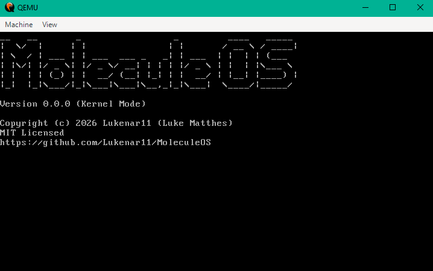
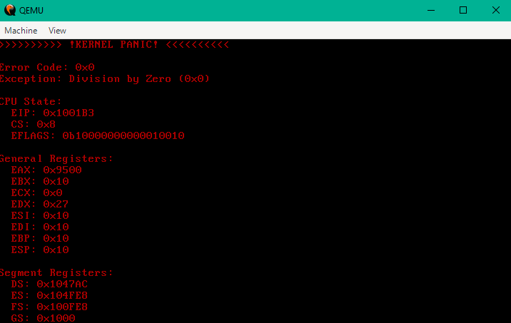

# MoleculeOS

**MoleculeOS** is a minimalist, text-based *i386* monolitic operating system, <br>
developed in C++ by GitHub user *Lukenar11 (Luke Matthes)*.

The goal of this project is to create a clearly structured, <br>
modular learning and experimentation system that makes the fundamental building blocks of an operating system <br>
understandable and transparent - hence the name *MoleculeOS*.

---

## Features (current / planned)

- Minimal 32‑bit kernel in C++
- VGA text mode output
- Basic hardware initialization
- Interrupt Descriptor Table (IDT)
- More subsystems to follow

---

## Design Philosophy

MoleculeOS is intentionally simple:

- no paging  
- no multitasking  
- no 64‑bit mode  
- no complex drivers

The goal is to understand the *essence* of OS development without unnecessary complexity.

---

## Current Boot Output

Below is the current state of MoleculeOS running in QEMU:



Below is the current state of MoleculeOS running in QEMU (deliberately triggered panic with a division by 0):



---

## Requirements

To build and run MoleculeOS, the following software is required:

- **NASM** (Netwide Assembler for Boot and Assembly Fiels in the Kernel)
- **Clang++** (for compiling the 32‑bit kernel and the C++ runtime, requires i386 target support)
- **Clang** (for compiling the C Runtime and C komponentes in the Kernel, requires i386 target support)
- **Make** (for Building and running the Project)
- **QEMU** (for running the OS in a virtual machine)

---

## Build & Run

``` bash
    make clean
    make
    make run
```

This will:

- assemble the bootloader
- compile the kernel
- compile the runtime
- build a *.elf* File
- launch QEMU
